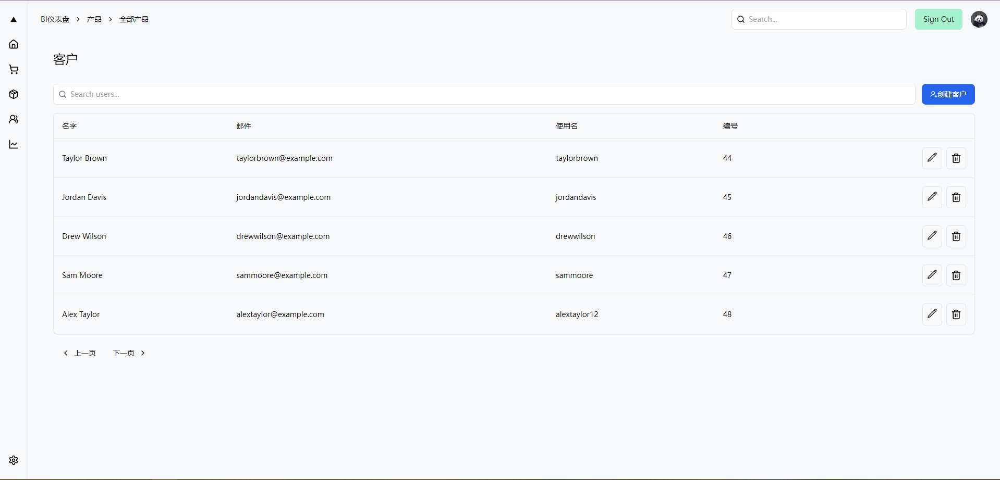
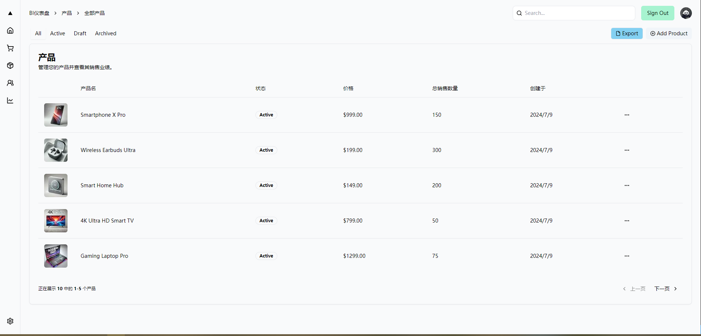

This is a [Next.js](https://nextjs.org/) project bootstrapped with [`create-next-app`](https://github.com/vercel/next.js/tree/canary/packages/create-next-app).




## Overview

This is a starter template using the following stack:

- Framework - [Next.js 14](https://nextjs.org/)
- Language - [TypeScript](https://www.typescriptlang.org)
- Auth - [Auth.js](https://authjs.dev)
- Database - [Postgres](https://vercel.com/postgres)
- Deployment - [Vercel](https://vercel.com/docs/concepts/next.js/overview)
- Styling - [Tailwind CSS](https://tailwindcss.com)
- Components - [Shadcn UI](https://ui.shadcn.com/)
- Analytics - [Vercel Analytics](https://vercel.com/analytics)
- Formatting - [Prettier](https://prettier.io)

## Getting Started

** Data access is connected to the local postgres database.

First, install the pg module:
```bash
yarn add pg
# or
npm install pg
```
Step 2, install '@types/pg'
```bash
npm install --save-dev @types/pg
# or
yarn add --dev @types/pg

```
Create a new Local Postgres database and excute the clients.sql file.

install 'tailwind-merge' to merge the tailwind.config.js files
```bash
npm install tailwind-merge
# or
yarn add tailwind-merge
```
install 'clsx' to merge the tailwind.config.js files
```bash
npm install clsx
# or
yarn add clsx
```
install class-variance-authority 
```bash
npm install class-variance-authority
# or
yarn add class-variance-authority
```
install @radix-ui/react-slot module 
```bash
npm install @radix-ui/react-slot
# or
yarn add @radix-ui/react-slot
```
install @vercel/analytics 
```bash
npm install @vercel/analytics
# or
yarn add @vercel/analytics
```
install @radix-ui/react-tooltip   
@radix-ui/react-tooltip 是一个 React 组件库的一部分，提供了一个高度可定制的工具提示（Tooltip）组件。Radix UI 是一组无样式和可访问的 UI 组件，可以在 React 项目中使用。通过 @radix-ui/react-tooltip，你可以轻松地在你的应用中添加工具提示，并根据需要进行定制。
```bash
npm install @radix-ui/react-tooltip
# or
yarn add @radix-ui/react-tooltip
```
install lucide-react to add icons to your app  
lucide-react 是一个基于 Lucide 图标库的 React 组件库。Lucide 是一个开源的图标库，提供了一组现代、简洁且可定制的图标。lucide-react 将这些图标封装为 React 组件，使其可以轻松地在 React 应用中使用。
```bash
npm install lucide-react
# or
yarn add lucide-react
```
install @radix-ui/react-dialog  @radix-ui/react-dropdown-menu @radix-ui/react-tabs

```bash
npm install @radix-ui/react-dialog @radix-ui/react-dropdown-menu @radix-ui/react-tabs
# or
yarn add @radix-ui/react-dialog @radix-ui/react-dropdown-menu @radix-ui/react-tabs
```
Inside the local Postgres database, create a table based on the schema defined in this repository.
```bash
CREATE TYPE status AS ENUM ('active', 'inactive', 'archived');

CREATE TABLE products (
  id SERIAL PRIMARY KEY,
  image_url TEXT NOT NULL,
  name TEXT NOT NULL,
  status status NOT NULL,
  price NUMERIC(10, 2) NOT NULL,
  stock INTEGER NOT NULL,
  available_at TIMESTAMP NOT NULL
);
```
Execute the following statement in the terminal  
```bash
npm install dotnev
npm run seed
```
Run the development server:
```bash
npm run dev
# or
yarn dev
# or
pnpm dev
# or
bun dev
```

Open [http://localhost:3000](http://localhost:3000) with your browser to see the result.

You can start editing the page by modifying `app/page.tsx`. The page auto-updates as you edit the file.

## You can refer to the following resources to learn more:

 [`Admin Dashboard Template`](https://vercel.com/templates/next.js/admin-dashboard-tailwind-postgres-react-nextjs) 


## 如何确认你的GitHub OAuth应用程序的客户端ID和客户端密钥

步骤一：登录GitHub  
1. 打开浏览器并访问 GitHub。  
2. 使用您的GitHub账户进行登录。  

步骤二：访问开发者设置页面  
1. 登录后，点击右上角的头像，然后点击 Settings 进入用户设置页面。
2. 在设置页面左侧菜单中，向下滚动并找到 Developer settings，点击进入。
  
步骤三：访问OAuth应用程序设置  
1. 在 Developer settings 页面中，点击左侧菜单的 OAuth Apps。 
2. 这时，您应该能看到您创建的OAuth应用程序列表。如果您还没有创建OAuth应用程序，可以点击 New OAuth App 来创建一个新的。
  
步骤四：查看客户端ID和客户端密钥    
1. 点击您的OAuth应用程序的名称，进入应用程序详情页面。
2. 在详情页面中，您可以看到 Client ID。
3. Client Secret 默认是隐藏的，如果您需要查看或重置 Client Secret，可以点击 Generate a new client secret。请注意，生成新的客户端密钥后，旧的客户端密钥将不再有效。
